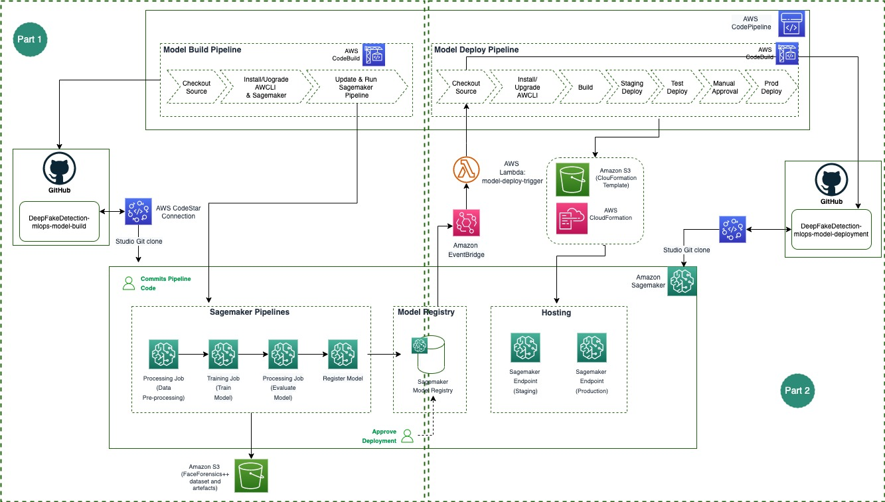
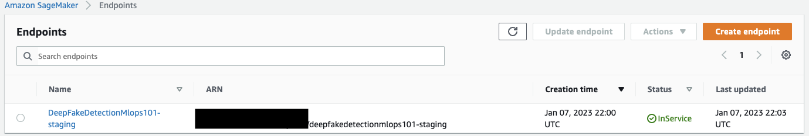

# Deepfake Detection MLOps - Build End-to-End Pipeline using Sagemaker Pipeline, AWS CodeBuild and AWS CodePipeline - Part 2

The project is created based on the [SageMaker Project Template - MLOps template for model building, training and deployment with third-party Git repositories](https://docs.aws.amazon.com/sagemaker/latest/dg/sagemaker-projects-templates-sm.html#sagemaker-projects-templates-git-code-pipeline).

## Overall Architecture

The overall architecture of the project is shown below:

The architecture is divided into two main parts:

* The first part involves processing data, training and testing models, and registering the models in the SageMaker Model Registry (in this [link](https://github.com/naram92/DeepFakeDetection-mlops-model-building)).
* The second part involves automating the deployment of models from the SageMaker Model Registry to SageMaker endpoints for real-time inference. When a new model version is registered and approved, it initiates a deployment automatically (in this repository).

## MLOps for SageMaker Endpoint Deployment

This code repository has the code to find the latest approved ModelPackage for the associated ModelPackageGroup and automaticaly deploy it to the Endpoint on detecting a change (`build.py`). This code repository also defines the CloudFormation template which defines the Endpoints as infrastructure. It also has configuration files associated with `staging` and `prod` stages. 

Upon triggering a deployment, the CodePipeline pipeline will deploy 2 Endpoints - `staging` and `prod`. After the first deployment is completed, the CodePipeline waits for a manual approval step for promotion to the prod stage. We will need to go to CodePipeline AWS Managed Console to complete this step.

### Project layout

`buildspec.yml`
 - this file is used by the CodePipeline's Build stage to build a CloudFormation template.

`build.py`
 - this python file contains code to get the latest approve package arn and exports staging and configuration files. This is invoked from the Build stage.

`endpoint-config-template.yml`
 - this CloudFormation template file is packaged by the build step in the CodePipeline and is deployed in different stages.

`staging-config.json`
 - this configuration file is used to customize `staging` stage in the pipeline. 

`prod-config.json`
 - this configuration file is used to customize `prod` stage in the pipeline.

`test\buildspec.yml`
  - this file is used by the CodePipeline's `staging` stage to run the test code of the following python file

`test\test.py`
  - this python file contains code to describe and invoke the staging endpoint. 

